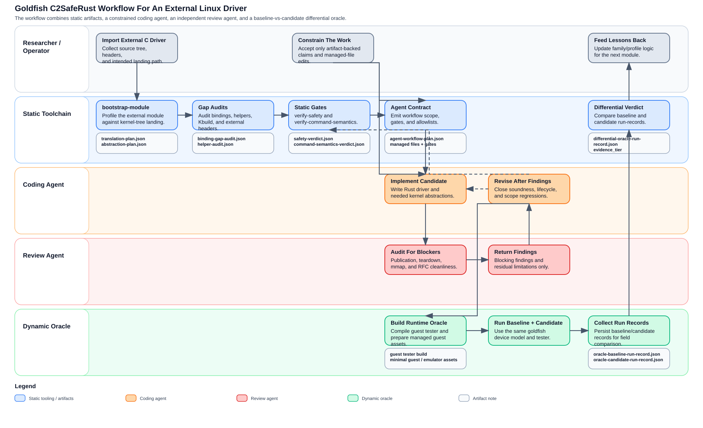

# `goldfish_address_space` 完整复盘：从 external source 驱动到 `C2SafeRust` 工作流

## 1. 总结：这次 goldfish 工作真正完成了什么

这次工作的最终价值，不是“手工把一个 Android/goldfish 外部模块翻译成 Rust”，而是借
`goldfish_address_space` 这条线，把一条面向 Linux 内核 external-source 模块的
`C2SafeRust` 开发流程跑通，并且把关键约束沉淀成可复用的工具产物、静态 gate、
dynamic oracle 和 agent 协作模式。

从最终目标“设计一个面向 Linux 内核的 `C2SafeRust` 开发工具”回看，这次 goldfish
实践的意义主要有三点：

1. 它验证了 out-of-tree 模块 Rust 化并不是简单的“照着 C 代码重写一份 Rust”，而是
   一条需要 source intake、header landing、abstraction gap 识别、static
   safety/soundness gate、baseline/candidate 双树差分、真实设备模型动态验证共同
   组成的流程。
2. 它把 agent 从“自由写代码”收紧成了“先读 artifact，再在 managed scope 内实现，
   然后接受 gate 和 reviewer 审计”的受约束工作模式。
3. 它证明了 reviewer agent 的角色不能被“编译通过”替代。真正的 blocker 来自
   publication race、teardown 生命周期、mmap 授权模型、RFC 最小化等内核语义问题，
   而不是语法或风格问题。

这份复盘只讲工具如何工作、不同 agent 如何协作，以及整个流程如何一步一步收敛。
它不覆盖“为什么选 goldfish”以及“最终如何发 RFC 邮件”两部分内容。

## 2. 总说：如果要把一个 out-of-tree Linux 模块实现为 Rust 驱动，需要经历什么

把一个 out-of-tree 模块实现成 Rust 驱动，核心步骤可以概括成以下几类。

### 2.1 先做 source intake，而不是直接翻译

对 external-source 模块，第一步不是开写 Rust，而是先把源模块放进 profile 化的
intake 流程里，回答几个问题：

- 这个模块实际依赖哪些头文件、helpers、Kbuild 接入点、回调和子系统 API。
- 哪些内容可以直接走现有 Rust abstraction。
- 哪些内容必须先在 `rust/kernel/` 中补 abstraction，驱动本身才有机会保持
  `#![forbid(unsafe_code)]`。
- 哪些外部 header/UAPI 必须 landing，哪些只是 vendor 私有实现细节，不应该带进
  upstream。

这一步在工具里对应 `bootstrap-module` / `refresh-artifacts` 生成的一组静态产物，
包括：

- `translation-plan.json`
- `abstraction-plan.json`
- `binding-gap-audit.json`
- `helper-audit.json`
- `kbuild-plan.json`
- `external-header-plan.json`
- `unsafe-obligations.json`

### 2.2 先补抽象缺口，再写 driver

对于 out-of-tree 模块，Rust 驱动能不能保持 safe，常常不取决于 driver 代码本身，而
取决于 kernel Rust abstraction 是否已经补齐。

goldfish 这次的抽象缺口主要落在：

- `miscdevice`
- `pci`
- `page`
- `uaccess`
- 一度还包括 `mm/virt`

工具并不是直接生成 driver，而是先把 external C 模块的需求分解成这些 abstraction
问题，再由编码 agent 在受控范围内补 abstraction 与 driver。这和重写 `nlmon` 这类
in-tree 模块不同：`nlmon` 的 Kbuild、headers、内核生命周期语义都已经在树内，更多是
对已有 in-tree 模块做 Rust 参考实现；goldfish 则首先要解决“外部驱动怎样落进树里”
和“它依赖的 Rust abstraction 是否足够”。

### 2.3 必须有静态 gate，不能只靠人工读 unsafe

对 external-source 模块，单靠人工审代码，很难稳定判断：

- driver 是否偷偷越过 safe abstraction 直接碰 `bindings::*`
- abstraction 层的 unsafe proof site 是否发生漂移
- 当前 claim 的 soundness 边界到底是什么

因此流程里必须有工具化的静态 gate：

- `verify-safety`
- `verify-command-semantics`
- `agent-workflow-plan`
- `soundness-discharge`
- `safety-verdict`
- `safety-violation-ledger`

这一步的目标不是“证明绝对安全”，而是把 safety/soundness claim 缩到可以逐项审计的
artifact 上。

### 2.4 必须有 baseline/candidate 差分，而不是 candidate 单边 smoke

对 out-of-tree 模块，单边运行 Rust candidate 只能说明“它在当前环境里能跑起来”，
不能说明“它和原始 C 语义等价”。

所以 goldfish 流程必须建立两类对象：

- baseline：C control tree 或 stock baseline
- candidate：Rust candidate tree

然后在同一 goldfish 设备模型、同一 guest tester、同一 required operations 上跑
differential oracle，输出：

- `oracle-baseline-run-record.json`
- `oracle-candidate-run-record.json`
- `differential-oracle-run-record.json`

### 2.5 必须把 agent 分工成“编码”和“审计”两条线

对于 goldfish 这种 external-source 模块，单个 agent 同时负责“写代码”和“证明自己写得
够安全、够 upstream-clean”是靠不住的。流程里必须把角色拆开：

- 编码 agent：在 artifact 约束下写 abstraction 和 driver。
- 审计/reviewer agent：不负责写实现，而是专门找 blocker，判断是否达到 RFC 的初步
  标准。

这也是 goldfish 和 `nlmon` 的另一个重要差别。`nlmon` 更像是对一个 in-tree 参考模块
跑通第一条工作流；goldfish 则真正暴露了“review 闭环”在 external-source 驱动迁移中
的核心地位。

### 2.6 与重写一个 in-tree 模块相比，goldfish 多了什么

| 维度 | `nlmon`（in-tree） | `goldfish_address_space`（out-of-tree） |
| --- | --- | --- |
| 源码来源 | 已在主线树内 | source tree 独立于主线 |
| 头文件/接口 | tree 内已有 | 需要 `external-header-plan` 判定 landing 范围 |
| baseline | 主要是 tree 内 reference module | 需要 stock/C baseline 与 Rust candidate 双树 |
| 动态验证 | QEMU smoke 足够跑通首个闭环 | 必须进入 Android/goldfish 设备模型和 guest tester |
| agent 工作边界 | 多为 driver + 少量 abstraction | driver + abstraction + external landing 一起收敛 |
| reviewer 关注点 | MVP 回调与 net 语义 | publication、teardown、mmap、probe unwind、RFC 最小化 |

## 3. 分说：这次 goldfish 流程是如何一步一步推进的

### 3.1 第一步：把 external C 驱动 intake 成可消费的 artifact

整个流程真正的起点，不是 Rust 代码，而是 external source 的结构化 intake。

这一步主要依赖：

- `scripts/c2saferust/tool_cli.py`
- `scripts/c2saferust/intake.py`
- `scripts/c2saferust/profiles/modules/goldfish_address_space.json`
- `scripts/c2saferust/profiles/families/pci_miscdevice.json`
- `scripts/c2saferust/profiles/rule_packs/pci_miscdevice_core_safety.json`

做出的事情是：

- 把 source tree、kernel tree 和 landing tree 分离。
- 识别 goldfish 驱动的 family 是 `pci + miscdevice + file_operations`。
- 产出 Kbuild 接入、bindings/helper 缺口、unsafe obligations、translation plan 等
  artifact。

这一步的直接结果，是在
`Documentation/rust/c2saferust/goldfish_address_space/` 下生成了一整组规划文件：

- `translation-plan.json`
- `abstraction-plan.json`
- `binding-gap-audit.json`
- `bindings-patch-plan.json`
- `helper-audit.json`
- `helpers-patch-plan.json`
- `kbuild-plan.json`
- `kbuild-patch-plan.json`
- `external-header-plan.json`
- `unsafe-obligations.json`

这组 artifact 的意义，是把“做一个 Rust goldfish 驱动”拆成了更细的子问题：

- 哪些 external header 要真正 upstream landing。
- 哪些 helper 需要薄封装。
- 哪些能力应该进入 `rust/kernel/` abstraction，而不是泄漏给 driver。
- 当前第一轮 driver claim 的最小回调和 ABI 子集是什么。

### 3.2 第二步：把 out-of-tree 需求重写成内核 Rust abstraction 问题

goldfish 这条线的关键不是“driver 本身多复杂”，而是它所依赖的 safe abstraction
是否存在。

工具在这一步做了两件事。

第一，它通过 `binding-gap-audit`、`helper-audit` 和 `abstraction-plan` 把外部 C
驱动的依赖重写成内核抽象缺口。例如：

- `miscdevice` 要能表达 typed registration data、safe open context、owner pinning。
- `pci` 需要支持 shared BAR 的受管 reservation 与 `memremap()` 生命周期。
- `page` 要有 page-backed ping state 所需的安全 helper。
- `uaccess` 要保持 driver 层不碰 raw `copy_to_user/copy_from_user`。

第二，它把这些缺口收敛到 family/profile 层，而不是把 goldfish 写成一套硬编码脚本。
这一点对 `C2SafeRust` 工具尤其重要，因为工具的目标不是只服务 goldfish 一次，而是把
`pci_miscdevice` 这种 family 抽象出来，供后续模块复用。

这一步的结果是：编码 agent 并不是直接把 C driver 翻译成 Rust，而是在一组明确的
abstraction allowlist 内写代码。goldfish 的 `agent-workflow-plan.json` 已明确列出：

- managed files
- allowed driver surfaces
- forbidden driver calls
- required driver crate attributes
- acceptance gates

也就是说，工具先把“可写范围”和“不可越界的 API 边界”定义清楚，agent 才开始写代码。

### 3.3 第三步：先跑静态安全 gate，再允许进入实现和动态验证

在 goldfish 这条线里，静态 gate 不是附属检查，而是整个流程的前置条件。

核心工具是：

- `python3 scripts/c2saferust/tool_cli.py verify-safety`
- `python3 scripts/c2saferust/tool_cli.py verify-command-semantics`
- `scripts/c2saferust/workflow.py`
- `scripts/c2saferust/smoke.py`

核心 artifact 是：

- `safety-policy.json`
- `soundness-discharge.json`
- `safety-verdict.json`
- `safety-violation-ledger.json`
- `command-semantics.json`
- `command-semantics-verdict.json`
- `agent-workflow-plan.json`

这一步做的事情有三层。

第一层是 quick gate：

- driver 侧必须 `#![forbid(unsafe_code)]`
- driver 侧不得直接调用 `bindings::*`
- driver 侧不得越过抽象直接操作 raw 指针和底层 FFI token

第二层是 proof-site / soundness gate：

- abstraction 层的 unsafe block 不能只留在代码里，而是要在
  `soundness-discharge.json` 中逐项登记
- 一旦 proof site 漂移，就会在 `safety-violation-ledger.json` 中以
  `artifact_drift`、`stale-proof-site`、`unaccounted-unsafe-site` 形式暴露

第三层是 command semantics gate：

- 工具把关键 helper 明确分类为 `status-gated`、`readback-gated`、`issue-only`
- goldfish 这次最重要的语义纠偏之一，就是 `generate_handle` /
  `tell_ping_info_addr` 不能被 Rust 版误强化成 `STATUS` gate

这一步的意义，是在“代码能编译之前”先回答“当前实现是不是已经越过了工具允许的
soundness 边界”。

### 3.4 第四步：编码 agent 在受约束范围内生成和修正 Rust 代码

编码 agent 的工作，不是自由发挥式的“把 C 改写成 Rust”，而是在前述 artifact 约束下
做受限实现。这个线程中的主实现工作就属于这一类。

编码 agent 负责的内容包括：

- 在 `drivers/platform/goldfish/goldfish_address_space.rs` 中实现 Rust driver。
- 在 `rust/kernel/miscdevice.rs` 中补 publication-safe 和 module-pinning 相关抽象。
- 在 `rust/kernel/pci.rs`、`rust/kernel/pci/io.rs` 中补 shared BAR 生命周期抽象。
- 在 `rust/kernel/page.rs` 等位置补 driver 所需但仍可泛化的 helper。
- 保持 driver 本身 `#![forbid(unsafe_code)]`，把 unsafe 留在 abstraction 层。

这一步并不是一次完成的，而是多轮修改：

- 先实现最小 open/release/ioctl/mmap 路径。
- 再根据 static gate 的结果修 soundness artifact。
- 再根据 reviewer finding 修 publication race、teardown、mmap 生命周期、probe
  unwind、RFC 最小化等问题。

工具在这里起到的作用，是把 agent 的写入范围和目标边界固定下来，避免它把外部 C 习惯
直接搬进 driver。例如：

- 不能在 driver 里直接 `misc_register()` / `misc_deregister()`
- 不能在 driver 里直接 `remap_pfn_range`
- 不能把 raw `file_operations` 暴露给 safe driver

### 3.5 第五步：审计 agent / reviewer 独立找 blocker，而不是复读编译结果

这次 goldfish 流程里，第二个 agent 角色是 reviewer：它不负责写实现，而是负责用
RFC / upstream-ready 的标准审计这棵树到底还有哪些 blocker。

这部分流程的价值非常大，因为它暴露出来的不是“编译失败”级别的问题，而是更接近真正
maintainer 会拦下来的问题。典型审计点包括：

- `miscdevice` 的 publication race
- `file_operations.owner` / module pinning 边界
- live `FileState` 的 teardown hole
- `mmap` 授权是否真的 pin 住 range ownership
- hot-unplug/remove 是否依赖无界等待
- 删除未使用 VMA helper 时是否打断了 in-tree binder 用户
- `probe()` 失败路径是否完整回收 `enable_device_mem()`
- RFC 系列是否仍携带当前无调用方的泛化接口

这一步的意义在于，它把“代码写出来了”和“代码已经达到 RFC 初步标准了”严格区分开。
编码 agent 可以把功能闭合，但 reviewer agent 负责判断：

- soundness 是否真的闭合
- 生命周期是否真的可辩护
- abstraction 是否足够最小
- 当前 series 是否还带着 reviewer 会质疑的无用泛化

最终 goldfish 这条线能收口，不是因为一次编码成功，而是因为编码 agent 和 reviewer
agent 之间形成了多轮闭环。

### 3.6 第六步：动态 oracle 从 device-present smoke 升级到真实 differential

goldfish 这次最重要的流程升级之一，是把动态验证从“设备节点存在 + open/close”提升到
真实 baseline/candidate 差分。

这一步的核心工具是：

- `scripts/c2saferust/oracle_runners.py`
- `scripts/c2saferust/oracles/goldfish_address_space_tester.c`
- `python3 scripts/c2saferust/tool_cli.py run-oracle`
- `python3 scripts/c2saferust/tool_cli.py run-differential-oracle`

流程上实际做了几件事：

1. 先为 goldfish 增加 `android-goldfish-oracle` runner。
2. 再增加 dedicated guest tester `goldfish_address_space_tester.c`，避免只靠 shell
   smoke。
3. 再把 managed guest、minimal-linux boot、candidate kernel image、baseline tree
   kernel image、synthetic userdata/system/vendor 资产都统一收进 runner。
4. 最后把 baseline run-record 和 candidate run-record 放到同一 comparison fields
   集合下做差分。

这条链路的证据等级是逐步上升的：

- `device_present`
- `baseline_abi_pass`
- `differential_pass`

最终在真实实现树里收敛出的关键证据是：

- `oracle-baseline-run-record.json`
- `oracle-candidate-run-record.json`
- `differential-oracle-run-record.json`

以及对当前 oracle 覆盖范围内的明确 claim：

- required operations 有限
- comparison fields 有限
- 只对当前覆盖到的 ABI 子集主张 differential equivalence

这一步非常关键，因为它让工具能识别“Rust 版看起来更严格，但实际上与 C baseline 不等
价”的问题，也让等价 claim 从模糊陈述变成了有 comparison field 支撑的结构化结论。

### 3.7 第七步：把 reviewer 反馈和 oracle 结果再回写到工具流程

真正的方法论价值，来自最后这一步：goldfish 并不是一次性项目，而是被用来反向改进
`C2SafeRust` 工具本身。

通过这次实践，工具侧新增或强化了如下流程能力：

- `pci_miscdevice` family
- `goldfish_address_space` module profile
- `android-goldfish-oracle` runner
- `command-semantics` gate
- `evidence_tier` 梯度
- `differential-oracle-run-record` 结构
- source tree / kernel tree / landing tree 分离
- `agent-workflow-plan` 对 agent 可读/可写范围的约束

也就是说，goldfish 不是“又做了一个 Rust 驱动样例”，而是反向推动工具长出了：

- external-source 模块的 intake 能力
- `pci + miscdevice` family 的静态规则
- Android/goldfish 设备模型的动态 oracle 能力
- agent 与 reviewer 分工协作的流程骨架

## 4. 这次流程里用了哪些脚本、静态分析工具和检验工具

按功能归类，这次 goldfish 流程使用的工具可以分成四组。

### 4.1 静态 intake / planning

- `scripts/c2saferust/tool_cli.py`
- `scripts/c2saferust/intake.py`
- `scripts/c2saferust/profiles/modules/goldfish_address_space.json`
- `scripts/c2saferust/profiles/families/pci_miscdevice.json`
- `scripts/c2saferust/profiles/rule_packs/pci_miscdevice_core_safety.json`

输出：

- `translation-plan.json`
- `abstraction-plan.json`
- `binding-gap-audit.json`
- `helper-audit.json`
- `kbuild-plan.json`
- `external-header-plan.json`

### 4.2 静态 safety / semantics gate

- `tool_cli.py verify-safety`
- `tool_cli.py verify-command-semantics`
- `scripts/c2saferust/workflow.py`
- `scripts/c2saferust/smoke.py`

输出：

- `safety-verdict.json`
- `safety-violation-ledger.json`
- `command-semantics-verdict.json`
- `agent-workflow-plan.json`

### 4.3 动态 oracle / differential

- `scripts/c2saferust/oracle_runners.py`
- `scripts/c2saferust/oracles/goldfish_address_space_tester.c`
- Android emulator goldfish 设备模型
- managed guest/minimal guest 资产生成逻辑

输出：

- `android-runtime-probe.json`
- `oracle-baseline-run-record.json`
- `oracle-candidate-run-record.json`
- `differential-oracle-run-record.json`

### 4.4 agent 协作与人工审计接口

工具本身不替代 reviewer，而是把 reviewer 的输入输出结构化：

- 编码 agent 先受 `agent-workflow-plan.json` 约束
- reviewer agent 输出 blocking findings
- 主线程再将这些 findings 转成：
  - 代码修复
  - 静态 gate 复核
  - 动态 oracle 复跑
  - claim scope 收口

## 5. 多 agent 协作是如何工作的

这次 goldfish 的多 agent 协作，可以简化成一个双闭环模型。

### 5.1 编码闭环

参与者：

- 研究者/操作者
- 静态工具链
- 编码 agent

流程：

1. 研究者用 `bootstrap-module` / `refresh-artifacts` 生成 goldfish 的 planning artifact。
2. 工具把 agent 允许读写的范围、必须先过的 gate、deferred scope 固定在
   `agent-workflow-plan.json`。
3. 编码 agent 在该约束内修改 abstraction 和 driver。
4. 静态 gate 检查 soundness/command semantics/编译状态。
5. 若不通过，则回到编码 agent 继续修复。

### 5.2 审计闭环

参与者：

- 编码 agent
- reviewer agent
- 动态 oracle

流程：

1. 编码 agent 产出一个“功能上可运行”的 candidate。
2. reviewer agent 以 RFC/blocker 标准审计源代码，而不是只看功能。
3. 如果 reviewer 发现 publication race、teardown hole、mmap 生命周期或 RFC 最小化
   问题，candidate 不能进入“可发 RFC”状态。
4. 编码 agent 根据 findings 修代码。
5. 动态 oracle 重跑 baseline/candidate differential，确认修改没有破坏当前 claim。

这种职责分离的好处是：

- 编码 agent 关注实现和闭环。
- reviewer agent 关注 soundness、生命周期和 series cleanliness。
- oracle 负责给功能等价 claim 提供运行时证据。
- 静态 gate 负责把 claim 限制在 artifact 和 allowlist 上。

## 6. 从“设计一个面向 Linux 内核的 C2SafeRust 工具”回看，这次得到的流程优化

从最终目标回看，这次 goldfish 让我们得到的不是某个单点技巧，而是几条明确的流程优化。

### 6.1 从“人工判断”变成“artifact 驱动”

这次最重要的变化，是几乎所有关键判断都不再只存在于口头经验里，而是被固定到了
artifact：

- 计划边界在 `translation-plan.json`
- 抽象边界在 `abstraction-plan.json`
- 安全边界在 `safety-policy.json` / `soundness-discharge.json`
- 语义边界在 `command-semantics.json`
- agent 工作边界在 `agent-workflow-plan.json`
- 动态证据边界在 `oracle-*.json` / `differential-oracle-run-record.json`

### 6.2 从“单 agent 写代码”变成“编码 agent + reviewer agent + oracle”的三方闭环

这次 goldfish 证明：

- 单 agent 代码生成可以推动实现，但不足以完成 upstream-ready 判断。
- reviewer agent 必须独立负责 blocker 发现。
- dynamic oracle 必须独立为功能等价 claim 提供 evidence tier。

也就是说，`C2SafeRust` 的最小闭环不是“工具 + 代码生成”，而是：

- 静态 artifact
- 编码 agent
- reviewer agent
- dynamic oracle

四者缺一不可。

### 6.3 从“candidate 单边通过”变成“baseline/candidate differential”

对 out-of-tree 模块，这次最大的流程升级是：我们不再满足于 candidate 单边成功，而是
要求在同一设备模型上对 baseline 和 candidate 做差分。

这直接带来了两个结果：

- 可以发现“更严格但不等价”的 Rust 语义偏差。
- 可以把最终 claim 限制到 `required_operations + comparison_fields` 的真实覆盖范围。

### 6.4 从“具体模块迁移”反哺“可复用 family/profile”

goldfish 这次不是一次性的案例脚本，而是逼着工具长出了：

- `pci_miscdevice` family
- external-source intake
- Android/goldfish runner
- command semantics gate
- evidence tier 梯度

这意味着后续再遇到同类 `pci + miscdevice + file_operations` 模块时，不再需要从零建立
工作流，而可以从现有 family/profile 出发。

## 7. 这次工作的最终结果

如果只从 goldfish driver 自身看，这次工作得到的是：

- 一个经过多轮审计修复的 Rust `goldfish_address_space` 实现
- 一套围绕 `miscdevice` / `pci` / `page` 的 abstraction 修补
- 一组可以支撑有限 ABI 等价 claim 的 dynamic oracle 证据

但如果回到最初目标“设计一个面向 Linux 内核的 `C2SafeRust` 开发工具”，更重要的结果
是：

1. 我们得到了一条适用于 external-source Linux 模块的完整流程，而不仅仅是一个成功
   样例。
2. 我们确认了 out-of-tree 驱动 Rust 化的真正难点不在于语法翻译，而在于：
   - source intake
   - abstraction landing
   - soundness gating
   - reviewer audit closure
   - baseline/candidate differential
3. 我们把 agent 的角色从“生成代码的助手”扩展成了“受 artifact 约束的编码节点”和
   “独立负责 blocker 审计的 reviewer 节点”。
4. 我们把 goldfish 这次实践中最关键的流程关系抽象成了一张工具工作流图，见下节。

## 8. 工具工作流图

下图是这次 goldfish 流程对 `C2SafeRust` 工具的最终抽象。图中只保留工具如何工作、
agent 如何协作、静态 gate 与动态 oracle 如何闭环，不包含选题过程和最终 RFC 发送。



图中的五条泳道分别对应：

- `Researcher / Operator`
- `Static Toolchain`
- `Coding Agent`
- `Review Agent`
- `Dynamic Oracle`

如果要复现或修改该图，请使用：

- `scripts/c2saferust/render_goldfish_retrospective_flow.py`

生成命令：

```bash
python3 scripts/c2saferust/render_goldfish_retrospective_flow.py \
  --output Documentation/rust/c2saferust/goldfish_address_space/goldfish_tool_workflow.svg
```
